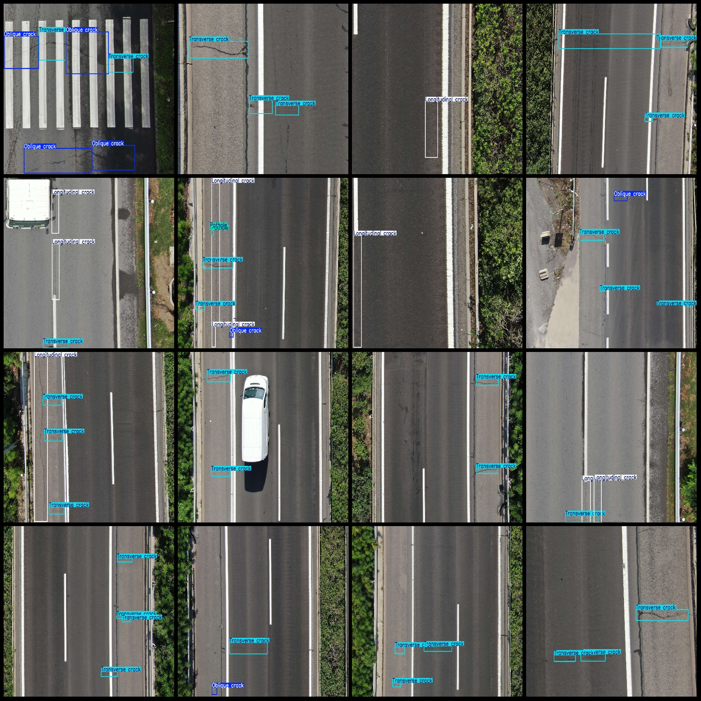
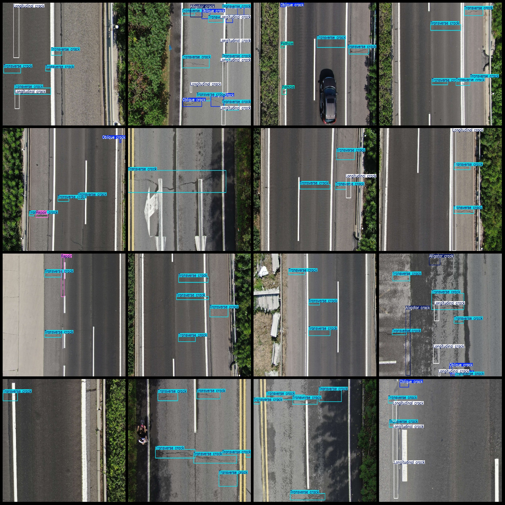

# Drone Perspective Urban Asphalt Road Surface Defects, Crackings, Holes Detection Dataset (VOC+YOLO Format) with 2424 Images in 6 Categories

Dataset Format: Pascal VOC format + YOLO format (without split path in txt file, only containing jpg images along with corresponding VOC format xml files and YOLO format txt files)
Number of Images (jpg File Count): 2424
Number of Annotations (xml File Count): 2424
Number of Annotations (txt File Count): 2424
Number of Categories: 6
Annotation Category Names (Note that the order of categories in the YOLO format does not correspond to this, but refer to the 'labels' folder 'classes.txt' for reference): ["Alligator Crack", 
"Longitudinal Crack", "Oblique Crack", "Pothole", "Repair", "Transverse Crack"]
Box Count per Category:
- Alligator Crack Box Count = 603
- Longitudinal Crack Box Count = 2994
- Oblique Crack Box Count = 1686
- Pothole Box Count = 195
- Repair Box Count = 282
- Transverse Crack Box Count = 5394
Total Box Count: 11154
Image Resolution: 1920x1440
Annotation Tool Used: labelImg
Annotation Rules: Mark boxes for each category
Important Note: The dataset does not have separate training, validation, or test sets; users must divide them themselves.
Special Remark: This dataset does not guarantee any accuracy in the trained models or weight files.
Image Preview:
Annotated Example:
## Images

Here is a pay link on Stripe ( https://buy.stripe.com/3cs8yP7sY87d0vu9AB ). Please contact me lonlonago@foxmail.com after funding $89, and I will send you a complete data files , thank you!

